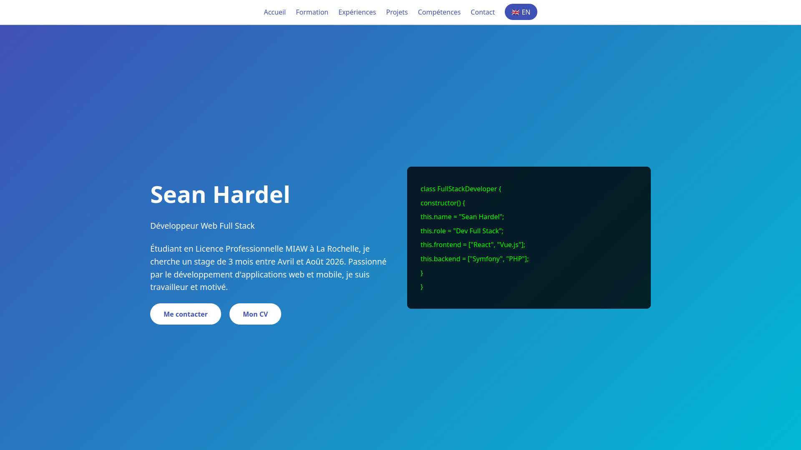

# Portfolio - Sean Hardel



> **Démo en ligne :** [Voir le portfolio](https://hardelsean.github.io/PortFolio/)

## 📄 Présentation

Bienvenue sur le dépôt de mon portfolio personnel. Ce projet met en avant mes compétences, mes expériences professionnelles et mes projets en tant que **Développeur Web Full Stack**. Le site est responsive, interactif et entièrement bilingue (Français/Anglais).

Je suis actuellement étudiant en **Licence Pro MIAW** (Métiers de l'Informatique : Applications Web) à l'Université de La Rochelle, à la recherche d'un **stage de 3 mois minimum** à partir d'avril 2026.

## ✨ Fonctionnalités

* **Bilingue :** Versions complètes en Français et Anglais (`index.html` & `index-en.html`).
* **Animations Modernes :** Utilisation de **GSAP** (GreenSock) & **ScrollTrigger** pour des effets d'apparition fluides et une présentation dynamique du code.
* **Design Responsive :** Adapté pour mobile, tablette et desktop (Flexbox & Grid).
* **Interface Interactive :** Navigation surlignée au scroll et effets de survol.
* **Code Propre :** Structure sémantique HTML5 et séparation claire CSS/JS.

## 🛠 Technologies Utilisées

* **Frontend :** HTML5, CSS3, JavaScript (ES6+)
* **Librairie d'Animation :** [GSAP 3](https://greensock.com/gsap/) (Plugin ScrollTrigger)
* **Versionning :** Git / GitHub

## 📂 Structure du Projet

```bash
├── assets/          # CVs (PDF) & Images
├── css/
│   └── styles.css   # Feuille de style principale
├── js/
│   └── script.js    # Logique et configurations GSAP
├── index.html       # Version Française (Entrée principale)
└── index-en.html    # Version Anglaise
```

## 🚀 Installation locale

S'agissant d'un site statique, aucune compilation n'est requise.

1.  **Cloner le dépôt :**
    ```bash
    git clone [https://github.com/hardelsean/PortFolio.git](https://github.com/hardelsean/PortFolio.git)
    ```

2.  **Lancer le projet :**
    Ouvrez simplement `index.html` dans votre navigateur.
    *Pour un fonctionnement optimal des modules ES6, l'utilisation d'un serveur local (comme l'extension "Live Server" de VS Code) est recommandée.*

## 📬 Contact

* **Email :** [sean.hardel04@gmail.com](mailto:sean.hardel04@gmail.com)
* **LinkedIn :** [Sean Hardel](https://www.linkedin.com/in/sean-hardel-2b4201355/)
* **Localisation :** La Rochelle, France

---
*© 2025 Sean Hardel - Tous droits réservés.*